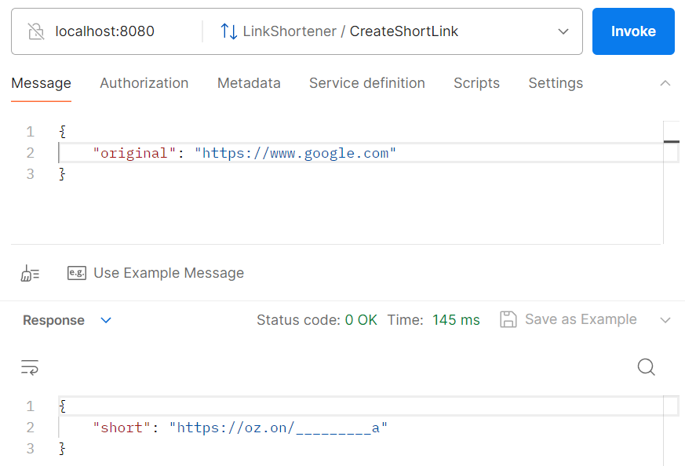
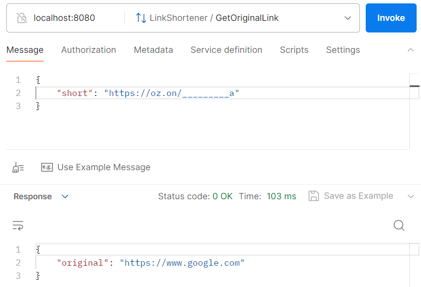
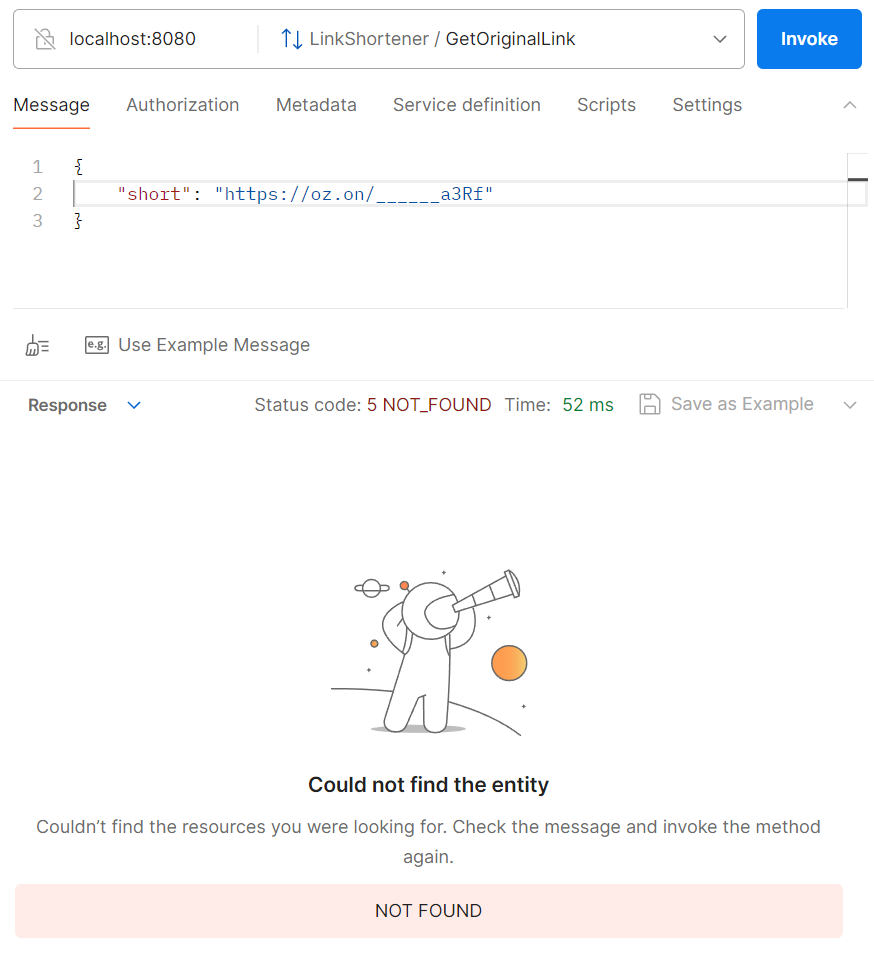
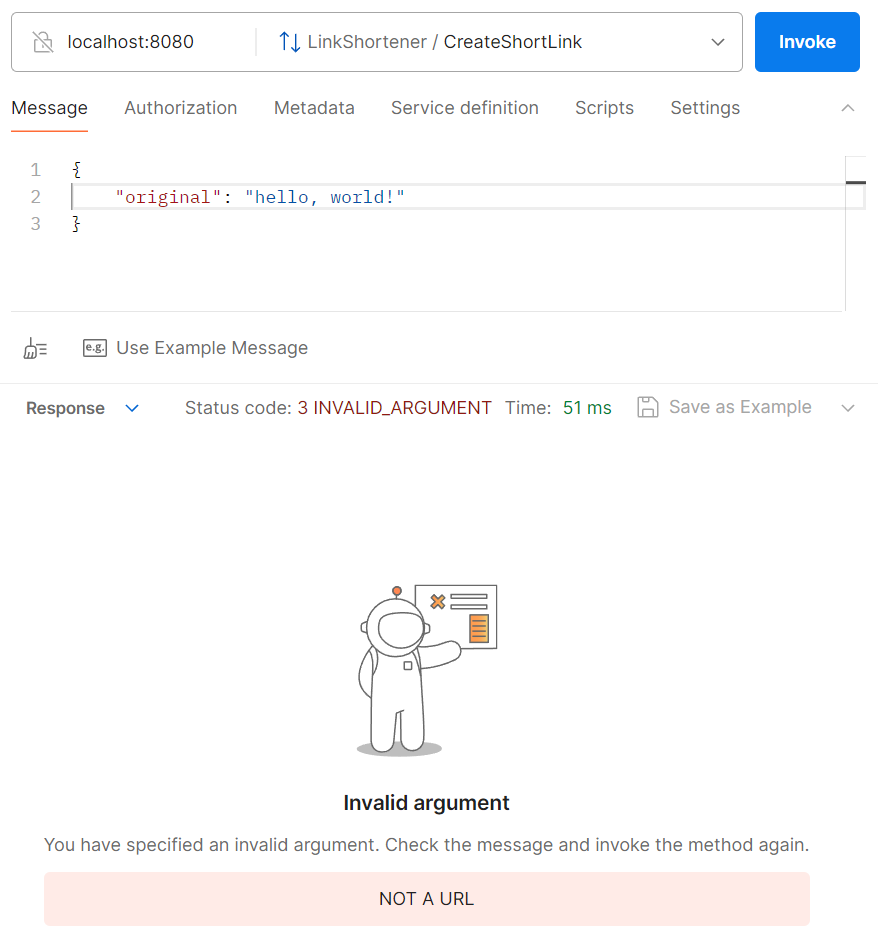

# gRPC URL shortener
## 1. Архитектура
Сервис написан на Go 1.21 и упакован в докер-образ. Сервис имеет 2 эндпоинта - для создания сокращенной ссылки
(**CreateShortLink**) и для получения оригинальной ссылки по сокращенной из БД (**GetOriginalLink**). Сервис
использует 2 хранилища для сокращенных ссылок (in-memory и PostgreSQL), пользователь может выбрать одно из них,
указав это в качестве параметра запуска.

Для выбора типа хранилища при запуске сервиса в виде докер-образа нужно изменить поле **command** в файле **docker-compose.yml**.
По умолчанию запускается PostgreSQL хранилище, которое сохраняет данные при перезапуске сервиса. 

Генерация сокращенных ссылок происходит по уникальному ID ссылки в базе. Это позволяет гарантировать отсутсвие коллизий,
а условие задачи в виде длины ссылки в 10 символов дает огромный запас по количеству возможных ссылок в базе (а именно 62^10 - 1 уникальных
ссылок, т.к. для кодирования используется base62).

В качестве in-memory хранилища используется **map[int]string**, где ключом является ID ссылки, а значением - оригинальная ссылка.
Таким образом, при создании новой ссылки берется последний использованный ID в БД, инкрементируется, кодируется с помощью base62 и
добавляется в БД с оригинальной ссылкой. \
PostgreSQL хранилище устроено похожим образом. В БД создается таблица **urls** (с помощью скрипта init.sql, который подтягивается и
выполняется автоматически в докер-контейнере postgres):

| Поле | Тип    |
|------|--------|
| id   | SERIAL |
| original | VARCHAR(255) |

При создании ссылки проверяется, была ли сгенерирована сокращенная ссылка для этой ссылки ранее. Если да, то пользователь
получает сгенерированную ранее ссылку, а не новую.

Каждый запрос на получение оригинальной URL проверяется на соответствие шаблону (домен + заданное число знаков для сокращенной ссылки), и если запрос не
соответсвует ему, то сервис возвращает **INVALID FORMAT**. Если для полученной сервисом сокращенной ссылки нет оригинальной, сервис возвращает
**NOT FOUND**. Запросы вида *domain/___* и *domain/a__* так же получают **INVALID FORMAT**. Если включен параметр `CHECK_URLS`, то если при создании
сокращенной ссылки введена не валидная ссылка, то сервис вернет **NOT A URL**.

## 2. Запсук
Перед запуском сервиса нужно создать в корневой директории конфигурационный файл **.env**
со следующим содержанием:

```
POSTGRES_USER = postgres
POSTGRES_PASSWORD = your_super_password
POSTGRES_DB = url_shortener
DB_PORT = 5432
DB_HOST = db
URL_DOMAIN = https://oz.on/
SERVER_PORT = 8080
SHORT_LEN = 10
FILLING_CHAR = _
CHECK_URLS = 1
```
Параметр **URL_DOMAIN** отвечает за домен сокращенной ссылки. Если **CHECK_URLS** имеет значение `1`, то будет включена проверка
валидности URL как на создание новой сокращенной ссылки, так и на получение оригинальной. **SHORT_LEN** - длина сгенерированной ссылки, по условию задачи равна 10.
**FILLING_CHAR** - символ, использующийся для заполнения *пустого пространства* ссылки. Т.е. если, например, генерируется ссылка *er25g*,
а **SHORT_LEN** имеет значение 10, то нам не хвататет еще 5 символов для заполнения. Итоговая ссылка будет иметь вид:
```
https://oz.on/_____er25g
```
Для запсука решения удобнее всего использовать Makefile. Для начала нужно сгенерировать код из файла `proto/shortener.proto`, что делается
командой `make generate`. После следует выполнить команду `make build_and_run`, которая собирает сервис и запускает docker. Для запуска сервиса
без пересборки предусмотрена команда `make run`.

## 3. Тестирование
Для тестирования сервиса я использовал **Testify** и **SQL Mock**. Для запуска всех тестов следует выполнить команду `make test`.
Тестами покрыт как сам gRPC сервер (который находится по пути `shortener/shortener.go`), так и оба хранилища (`internal/storage/storage.go`).

В ходе тестов сервера создается мок-хранилище с заданным функционалом. Проверяются методы создания ссылки и загрузки ее из БД. Так же проверяются
функции кодирования и декодирования ID в base62.

Тестирование хранилища проверяет корректность записи и чтения данных, получения последнего ID и т.д. Для проверки postgres-решения используется **sqlmock**,
который имитирует поведения СУБД.

Так же реализованы тесты для проверки валидатора URL.

## 4. Пример
Создание сокращенной ссылки:


Получение оригинальной ссылки:


В БД нет введенной ссылки:


Случайный текст вместо ссылки (с включенным параметром `CHECK_URLS`):

